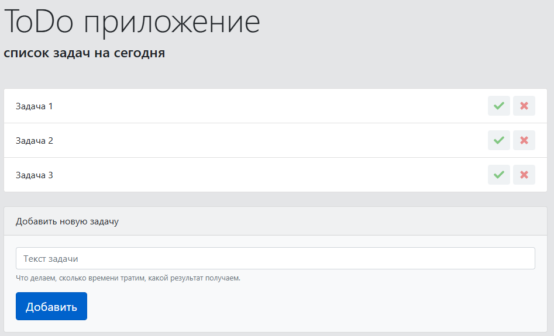

# 📝 ToDo Приложение на JavaScript

Простое и интуитивно понятное веб-приложение для управления повседневными задачами. Создано с использованием чистого JavaScript, HTML5 и CSS3.

## ✨ Ключевые возможности

- 🆕 **Добавление задач** через удобную форму ввода
- ✅ **Отметка выполненных** задач (визуальное зачёркивание)
- 🗑️ **Удаление задач** одной кнопкой
- 💾 **Автосохранение** в localStorage браузера
- 📱 **Адаптивный интерфейс** на Bootstrap 4
- 📭 **Визуальный индикатор** пустого списка
- 🎨 **Чистый минималистичный дизайн**

## Cкрин проекта
;

## 🚀 Запуск приложения

1. **Клонируйте репозиторий:**
```bash
git clone https://github.com/ваш-username/todo-app.git
cd todo-app


## 📁 Структура проекта

| Путь | Назначение |
|------|------------|
| `index.html` | Основная HTML-страница |
| `css/main.css` | Пользовательские стили |
| `js/main.js` | Логика приложения |
| `img/leaf.svg` | Иконка "список пуст" |
| `img/tick.svg` | Иконка "выполнено" |
| `img/cross.svg` | Иконка "удалить" |

## Описание файлов

### `index.html`
Главная HTML-страница приложения. Содержит:
- Базовая разметка страницы
- Форма для добавления новых задач
- Контейнер для списка задач
- Подключение Bootstrap 4 и пользовательских стилей

### `css/main.css`
Пользовательские стили приложения:
- Адаптивная верстка
- Стили для элементов списка задач
- Анимации и эффекты наведения
- Кастомизация Bootstrap-компонентов

### `js/main.js`
Основная логика приложения на JavaScript:
- Управление добавлением/удалением задач
- Работа с localStorage для сохранения данных
- Обработка событий и взаимодействие с пользователем
- Генерация уникальных идентификаторов для задач

### `img/`
Папка с графическими ресурсами:
- `leaf.svg` - иконка для отображения при пустом списке задач
- `tick.svg` - иконка кнопки "выполнено" (зеленая галочка)
- `cross.svg` - иконка кнопки "удалить" (красный крестик);


